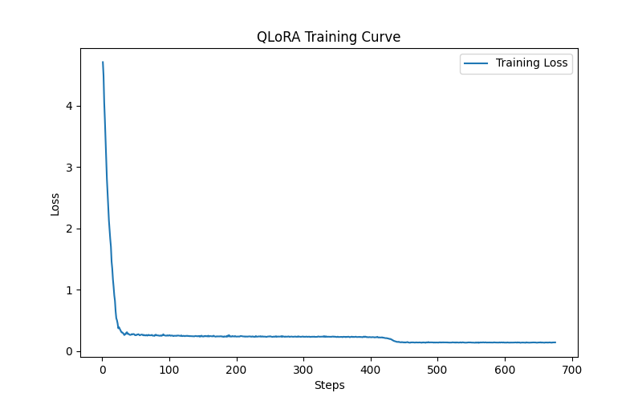

# Llama 3 QLoRA Agent Fine-Tuning for Synthetic Microscopy Reasoning

## Overview

This project demonstrates an end-to-end pipeline for:

- Synthetic ReAct-style dataset generation
- QLoRA fine-tuning of Llama 3 8B
- Tool-calling simulation environments
- Agent reasoning traces
- Base vs fine-tuned model comparison
- Closed-loop perception-to-action workflows

The system simulates a microscopy-inspired environment where structured perception signals are analyzed by an LLM agent trained using synthetic policy trajectories.

---

# Core Idea

Due to confidentiality restrictions, this repository uses a synthetic environment to reproduce the core reasoning and tool-calling structure of a real microscopy AI workflow. This project uses:

1. A synthetic perception environment
2. A rule-based teacher policy
3. ReAct-style trajectory generation
4. QLoRA fine-tuning
5. Interactive agent comparison

This demonstrates how structured synthetic data can steer tool-using LLM behavior.

---

# Features

- ReAct-style dataset generation
- Synthetic environment simulator
- Tool-calling loop
- Structured reasoning traces
- Action + mode policy outputs
- QLoRA fine-tuning pipeline
- Base vs fine-tuned model comparison
- Validation loss visualization
- Interactive Streamlit demo

---

# Project Structure

```text
llama3-qlora-agent/
│
├── README.md
├── requirements.txt
│
├── src/
│   ├── toy_env/
│   │   └── toy_environment.py
│   │
│   ├── llm_training/
│   │   └── qlora_train.py
│   │   └── teacher_policy.py
│   │
│   ├── visualization/
│   │   ├── evl_performance.py
│
├── data/
├── outputs/
└── assets/
```

---

# System Architecture

```text
Synthetic Environment
        ↓
Feature Extraction
        ↓
Teacher Policy
        ↓
ReAct Trajectory Generator
        ↓
QLoRA Fine-Tuning
        ↓
Tool-Using Agent
        ↓
Interactive Comparison UI
```

---

# Synthetic Environment

The environment simulates microscopy-inspired perception signals.

Current synthetic features:

| Feature | Description |
|---|---|
| region | single_cell / cluster / tissue_like |
| population_pct | percentage of cargo interactions |
| interaction_std | variability of membrane interaction |

The environment is intentionally simplified to demonstrate:

- structured reasoning
- policy learning
- tool-use adaptation
- synthetic trajectory generation

---

# Teacher Policy

The teacher policy generates:

## Actions
- stay
- move

## Modes
- normal
- post_analysis

The policy serves as a synthetic supervisory signal for QLoRA fine-tuning.

---

# ReAct Dataset Example

```json
{
  "messages": [
    {
      "role": "user",
      "content": "Region: cluster\nPopulation: 72%\nInteraction STD: 0.82"
    },
    {
      "role": "assistant",
      "content": "Thought: High population region detected.\nAction: analyze_features"
    },
    {
      "role": "tool",
      "content": "{\"region\": \"cluster\", \"population_pct\": 72.0, \"interaction_std\": 0.82}"
    },
    {
      "role": "assistant",
      "content": "Thought: High population and unstable region detected.\nMode: post_analysis\nAction: stay"
    }
  ]
}
```

---

# QLoRA Fine-Tuning

Base model:
- Meta-Llama-3-8B-Instruct

Training stack:
- Transformers
- PEFT
- TRL
- BitsAndBytes

Training objective:
- learn structured ReAct behavior
- improve tool-use consistency
- align reasoning policy outputs

---
## 📉 Training Loss Curve


# Evaluation

The project compares:


https://github.com/user-attachments/assets/13512625-a948-4c60-be89-b3d9f1e984c3


| Metric | Base Model | QLoRA Model |
|---|---|---|
| ReAct formatting | weak | strong |
| Action consistency | inconsistent | stable |
| Mode triggering | absent | learned |
| Tool reasoning | generic | policy-aligned |

Additional evaluation:
- train vs validation loss curves
- trajectory replay
- qualitative reasoning analysis

---

# Interactive Demo

The Streamlit UI compares:

- Base Llama 3.1 8B
- QLoRA-adapted Llama 3.1 8B

Both agents interact with the same synthetic environment.

The demo visualizes:
- reasoning traces
- tool outputs
- actions
- mode transitions
- response consistency

---

# Installation

## Clone Repository

```bash
git clone 
cd llama3-qlora-agent
```

## Install Dependencies

```bash
pip install -r requirements.txt
```

---

# Run Dataset Generation

```bash
python src/dataset/generator.py
```

---

# Run QLoRA Training

```bash
python src/training/qlora_train.py
```

---

# Launch Demo UI

```bash
streamlit run src/ui/streamlit_app.py
```

---

# Recommended Environment

- NVIDIA RTX 4090

Suggested workflow:

1. Generate dataset
2. Fine-tune using QLoRA
3. Evaluate model behavior
4. Launch comparison UI

---

# Future Work

Potential extensions:

- Real vision encoder integration
- Multi-step agent memory
- Persistent tool state
- Real microscopy feature extraction
- Multimodal perception inputs

---

# Research Motivation

This project explores how synthetic policy trajectories can shape structured tool-using behavior in large language models.

Focus areas:
- perception-to-action pipelines
- agent reasoning structure
- synthetic supervision
- controllable policy adaptation

---

# Disclaimer

This repository demonstrates a synthetic perception environment and is not intended to represent a production biological analysis system.

The environment is intentionally simplified to study agent behavior and reasoning adaptation.
